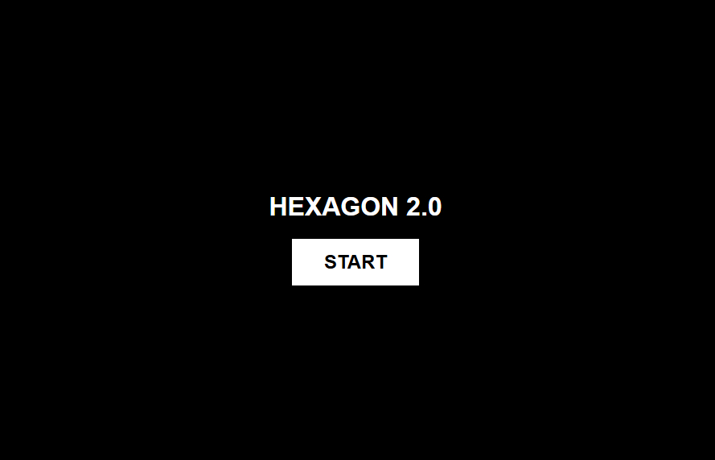

# 🔷 HEXAGON 2.0



Выживание в стиле классического Super Hexagon.
Написано на **React + TypeScript** с использованием **HTML5 Canvas** для 60 FPS геймплея.


## ⚡ Особенности

- **Олдскульная механика:** Мир вращается, стены сужаются, ты выживаешь.
- **Динамический ритм:** Пульсация центра и игрока синхронизирована с саундтреком.
- **Визуальный транс:** Плавная смена цветовых схем (Lerp) каждые 10 секунд.
- **Хардкор:** Рандомная смена направления вращения камеры от 1 до 5 секунд.
- **Эффекты:** Система частиц (particles) при столкновении и процедурная генерация угольных стен.

## 🕹 Управление

- **A / D** или **← / →** — Движение игрока по орбите.
- **Space / Enter** — Запуск игры и рестарт (мышка не нужна!).

## 🛠 Технический стек

- **React 18** (с хуками `useRef` для обхода лишних ререндеров).
- **TypeScript** (строгая типизация всех игровых сущностей).
- **Canvas API** (отрисовка через `requestAnimationFrame`).
- **ESLint & Prettier** (идеально чистый код).
- **Vite** (молниеносная сборка).

## 🚀 Как запустить локально

1. Клонируй репозиторий:
   ```bash
   git clone https://github.com/Vinkol/hexagon2.0
   ```
2. Установи зависимости:
   ```bash
   npm install
   ```
3. Запусти проект:
   ```bash
   npm run dev
   ```

## 📜 Планы на будущее

- [ ] Меню, настройки и тп.
- [✓] Таблица рекордов.
- [ ] Выбор уровней сложности.
- [ ] Эффект Screen Shake при ударе.
- [ ] Поддержка мобильных устройств (Touch events).

---

Создано с душой и азартом. Попробуй продержаться больше 60 секунд! 🔥
